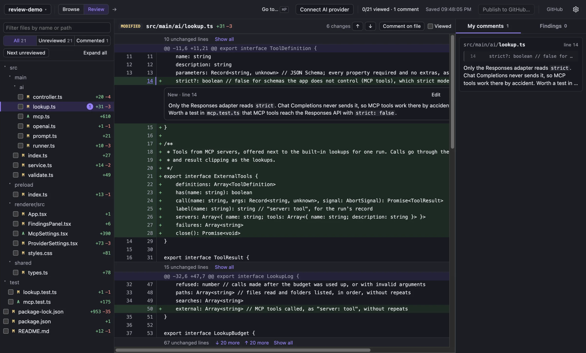

# Review

A local desktop app for reviewing committed branch changes in a Git repository, with optional AI-suggested findings.

**[Website](https://hamedghaderi.github.io/review/)** · **[Download for macOS, Windows and Linux](https://github.com/hamedghaderi/review/releases/latest)**



```sh
npm install
npm run dev        # development with hot reload
npm run build      # production bundle in out/
npm run dist       # macOS installers (Apple silicon and Intel) in dist/; dist:win and dist:linux for the others
npm start          # run the production bundle
npm test           # parser, diff model, Git, store, browsing, PR opening, AI review and provider checks (mock servers, temporary repos)
npm run typecheck
npm run format     # Prettier: tabs, single quotes, no semicolons
```

Requires Node 22.12+ and Git on `PATH`.

## Sharing the app

`npm run dist` builds the macOS installers into `dist/` (the first run downloads Electron and the packaging tools). `npm run dist:win` and `npm run dist:linux` build the others; on an Apple-silicon Mac they need Rosetta 2 (`softwareupdate --install-rosetta`), because electron-builder's installer tools for Windows and Linux are Intel programs.

| File                           | For                                    |
| ------------------------------ | -------------------------------------- |
| `Review-mac-arm64.dmg`         | Macs with Apple silicon (M1 and later) |
| `Review-mac-x64.dmg`           | Intel Macs                             |
| `Review-windows-setup.exe`     | Windows 10 and 11 (64-bit)             |
| `Review-linux-x86_64.AppImage` | Linux (64-bit)                         |

The file names carry no version, so the website's `releases/latest/download/…` links always point at the newest release. To release, bump `version` in `package.json`, build, and attach the four files to a GitHub release tagged `v<version>` (`gh release create v0.2.0 dist/Review-*.dmg dist/Review-*.exe dist/Review-*.AppImage`). There is no auto-update. Everyone needs Git installed; the GitHub CLI (`gh`) is optional.

The installers are not signed with an Apple Developer ID or a Windows certificate, so the system warns on the first open:

- **macOS**: drag Review to Applications and open it. macOS says it cannot check the app for malicious software. Open **System Settings → Privacy & Security**, scroll to "Review was blocked…", click **Open Anyway** and confirm. Only the first open needs this. (Or in Terminal: `xattr -dr com.apple.quarantine /Applications/Review.app`.) The app is signed ad hoc as a whole, which is what macOS needs for notifications and the keychain; after an update, macOS may ask once for the keychain password: choose **Always Allow**.
- **Windows**: SmartScreen says it protected your PC. Click **More info → Run anyway**.
- **Linux**: make the file executable (`chmod +x Review-*.AppImage`) and run it.

To remove the warnings, sign and notarize with an Apple Developer ID (`mac.identity` and `notarize` in `electron-builder.yml`) and a Windows code-signing certificate.

## Browsing and opening reviews

The app opens in the **Browse** workspace. The sidebar holds **Pull requests**, **Pinned** branches, **Local** branches and one entry per **remote**. Branch namespaces (`feat/`, `fix/`, `release/`…) are collapsible folders. Sidebar section, expanded folders, pins, searches, filter, selection, scroll position and the chosen base are saved per repository. **Open review** switches to the files/diff/comments workspace; **Browse** in the header goes back with everything as you left it.

Keyboard: `⌘P`/`Ctrl+P` quick open (PRs and branches), `/` focuses the visible search (not while typing elsewhere), `↑`/`↓`/`Home`/`End`/`PgUp`/`PgDn` move, `Enter` selects (or toggles a folder, `←`/`→` too), `⌘`/`Ctrl+Enter` opens the selected review, `Esc` clears the search or closes the palette. Tab moves between the sidebar, search, list and preview as usual.

Quick open starts with the PRs waiting for your review (when signed in to GitHub), your recent reviews, the checked-out branch and recently updated branches. Typing searches all of them; a branch that has a PR in the results is listed once, as the PR. `Tab` switches between All, Pull requests and Branches (or start the query with `pr ` or `b `). `Enter` opens the review (a branch against its default base), `⌘`/`Ctrl+Enter` shows the item in Browse instead, and `⌘`/`Ctrl+K` lists more actions: open on GitHub, copy link, copy branch name.

### Branches

Read with `git for-each-ref` only; nothing is fetched. `main`, `origin/main` and `upstream/main` are separate entries; `refs/remotes/*/HEAD` aliases are hidden. The checked-out branch is labelled _checked out_, which is separate from the selection. Ahead/behind numbers in rows are **relative to the configured upstream**. The preview shows ahead/behind relative to the chosen base and the exact merge base it will review.

The base picker is searchable. The default comes from the repository, not a hard-coded name: the remotes' `HEAD` targets (upstream first, then origin), then local branches of the same name, then `main`/`master`/`develop`/`trunk`. A review compares `merge-base(base, head)..head`. Missing refs, unrelated histories and shallow clones (where a merge base may just not be downloaded) are reported as such.

### Pull requests (GitHub)

Repositories are detected from HTTPS, SSH, scp-style and `git://` remotes. If remotes point at different GitHub repositories (fork `origin` plus `upstream`), `upstream` is used by default, and you can choose another one under **GitHub** in the header; the choice is saved per clone.

Filters: Open (includes drafts), Review requested, Mine, Drafts, Merged, Closed (unmerged), All. The default sort is most recently updated. Search runs on GitHub (`/search/issues` without a token, GraphQL with one) and is paginated, so it covers the whole repository. It is debounced, and a newer search cancels the one before it. It accepts title words, `#128`, pasted PR URLs, `@user`, and qualifiers such as `author:`, `head:`, `base:`, `label:`, `review-requested:` and `is:` (click **?** for examples). `repo:`, `org:` and `user:` are dropped so a search never leaves the repository. GitHub's 1,000-result cap and `incomplete_results` are shown as they are. If a refresh fails, the last results are kept and labelled with their fetch time. The preview loads details (description, commits, files, reviewers, SHAs) for the selected PR only.

**Review state.** Rows, the preview and the header of an open PR review show where a PR stands: **Approved** (×n), **Changes requested**, **Reviewed** (comments only), **n approvals, more required**, or **Review required**, plus what you did yourself ("you approved"). The badge follows GitHub's review decision when the repository has review rules. Without rules, it follows the reviews. Each person counts once, with their standing review: an approval or change request stands until they approve, request changes or are dismissed, and a later comment doesn't undo it. The PR author's own replies and pending reviews don't count. Approvals given on an older commit are labelled **(older commit)**. Change requests stay in force after new commits, as on GitHub. The preview lists who approved, requested changes and commented. With a token, list rows get this from the same search query, with no extra requests. Without a token, rows show nothing; the preview reads the PR's review list (one request), which has no review decision. An open PR review re-reads its state every 2 minutes. Search with `review:approved`, `review:changes_requested` or `reviewed-by:@me` to filter.

**Inbox.** The **Inbox** filter lists the open pull requests that need you, with where each one stands: **Re-requested** (asked again after you reviewed), **New** (requested and you haven't looked at it here yet; selecting it in the list counts as looking), **Waiting for you**, **New commits since your review**, and **Reviewed**. They're listed in that order, newest first within each. It combines two GitHub searches (`review-requested:@me`, which includes team requests, and `reviewed-by:@me`), up to 50 each, and needs a GitHub token.

**Review-request notifications.** While the app runs, it checks your review requests on GitHub every 3 minutes (one search across all repositories) and shows a desktop notification, with the system sound, for repositories you have opened in the app: a new request, a request after you already reviewed, or a draft marked ready. Drafts don't notify until they're ready. Clicking a notification opens that PR's review, switching repository if needed. More than 3 at once become one summary. The last state is stored, so requests that arrive while the app is closed are announced at the next start; the very first check only records what's there. The dock icon shows how many requests are open. Turn notifications or the sound off in **Settings · GitHub**. **Send a test notification** there shows a sample. If the system refuses a notification (on macOS: not allowed in System Settings → Notifications), the settings say so instead of review requests going missing silently. In development, `npm install` signs the downloaded Electron app locally (`scripts/sign-electron.mjs`), because macOS refuses notifications from an app bundle that isn't signed as a whole and never lists it in System Settings.

**Stacks.** A pull request is stacked on another when its base branch is that PR's branch. Turn on **Stacks** next to the filters to show each result under the PR it is stacked on. PRs the search didn't return but a result is stacked on (for example the parts underneath a stack whose review was requested from you) are added greyed out, so every stack reaches down to its base branch. The preview shows the PR's stack (`main › #101 › #102 › #103`) and what is stacked on it, with links. An open PR review shows "Stacked on #102 · 3 above" in the header. Reviewing a stacked PR already compares it with the branch it is stacked on, so you see only its own changes. The app connects stacks from one list of the repository's open PRs and their branches (one GraphQL request per 100 open PRs, cached for 2 minutes, up to 1,000). It needs a GitHub token; without one, results stay flat.

**Connecting GitHub** is optional; branches never need it. The quickest way is **Use GitHub CLI login** under **GitHub** in the header. If `gh` is installed and logged in, the app asks it for its token (`gh auth token`) when it needs one, re-reads it every few minutes and after a rejected request, and never stores it. It then has exactly the access `gh` has; publishing and private repositories need the `repo` scope, which `gh auth login` grants by default. A token saved in the app takes precedence over the gh login. The choice is kept in `github-settings.json` (no secrets). Alternatively: Paste a fine-grained personal access token with only **Pull requests: Read** under **GitHub** in the header (a prefilled creation link is provided). It is encrypted with the same credential service as AI keys (`ai-credentials.json`, id `github`) and never sent back to the renderer. Without a token, public repositories work with GitHub's anonymous limit of 60 requests an hour, and rows carry no branch names or review requests. The token is used for **API calls only**. Commits are fetched with Git, which uses your SSH keys or credential helper, so a connected token doesn't mean a fetch will work, and fetch failures say so.

### Opening a pull request

1. Read the PR's base repository, number, base SHA and head SHA from `GET /repos/{repo}/pulls/{n}`.
2. Fetch exactly those two commits by SHA (`git fetch --no-tags --no-write-fetch-head --refmap= <remote> +<sha>:refs/review/keep/<sha>`) from the remote for the base repository, or its HTTPS URL if there isn't one. Fork heads work because GitHub serves them from the base repository. Branches, remote-tracking refs, `FETCH_HEAD`, the index and the working tree are never touched, and the fetch is cancelled if you open something else or switch repositories.
3. Check that the pinned refs resolve to the requested SHAs.
4. Re-read the PR. If its head or base moved during the fetch, start over with the new pair, up to three times; the review shows a notice when this happens. It never mixes versions.
5. Compare `merge-base(base SHA, head SHA)..head SHA`. The PR base SHA, head SHA and merge base are stored separately. Local `HEAD` and GitHub's synthetic merge commit are never used.

When a closed or merged PR's commits can't be fetched any more, or its recorded base already contains the head, the app says the original comparison can't be rebuilt and offers **Open on GitHub**. It never shows an empty diff in that case.

Each review is pinned to its snapshot. While a review is open, the app checks the target (every 15 s for branches, locally; every 2 min for PRs, through the API) and shows **Update available**. Opening the update starts a new snapshot, and your comments carry over to it (see [Carrying comments forward](#carrying-comments-forward)). Findings and viewed files stay with the old snapshot, which keeps its own comments too and is still reachable from the Snapshot selector or **Recent reviews**. Opening a review never starts an AI review.

### Carrying comments forward

When you open a newer snapshot with **Review update** / **Fetch and review update**, or go from a branch review to its PR with **Open PR review**, each comment is copied into the new snapshot:

- **Lines unchanged**: the comment moves to the same lines in the new snapshot. Lines added or removed above it, and renames, are followed. Comments on the new version are compared head to head; comments on removed lines are compared base to base.
- **Lines changed**: the comment is marked **Outdated** and shown at the top of the file with the code it was written on (up to 40 lines) and the old line numbers. This also covers lines inserted inside the commented range, a deleted file, and a file that is no longer part of the change (listed in **My comments** only). Once outdated, a comment stays outdated in later snapshots.
- File comments move with the file.

The old snapshot is not changed. Each comment is carried from a snapshot once, so a comment you delete in the new snapshot doesn't come back. A new snapshot opened some other way (for example from **Browse**) carries from the latest snapshot of the same target; a pull request's first snapshot uses the latest review of its head branch. Drafts, findings, finding decisions and viewed files are not carried, and a carried comment loses its link to the AI finding it came from, since that finding belongs to the old snapshot's run. If the old commits can't be read any more, the review still opens and a notice says why nothing was carried.

Publishing: a comment already published from an earlier snapshot shows as published and isn't posted again, since GitHub keeps it on the PR itself. An outdated comment is treated like one outside the diff: skipped, or posted as a file comment that names its old lines and commit (`**lines 20–21 at 1a2b3c4:** …`).

## Existing discussion on GitHub

PR reviews show what has already been said on the pull request, so you and the AI don't raise a point that was discussed or resolved already. It only reads from GitHub: nothing is posted, replied to or resolved from here, and existing comments never go into what **Publish** sends.

- **In the diff**: each review thread appears under the lines it is about, marked **On GitHub**, above your own comments on those lines. It shows its status (**Open**, **Resolved by …**, **Outdated**), every comment with its author and their role on the repository, and a link to GitHub. Resolved threads start collapsed. Unresolved threads stay open even when outdated, because code moving is not the same as someone handling the point.
- **Placement**: a thread appears at a line only where GitHub reports a current position. On a snapshot older than the PR's head, that position is carried back to the snapshot's lines when none of them changed in between (following lines added or removed above). On the commit a thread was written on, its original lines are used. Everything else is listed at the top of its file with the reason and the diff GitHub showed when it was written: outdated threads, lines that differ in this snapshot, old-side threads on another version, and a PR head that isn't in the local repository. Threads on files outside this snapshot's changes appear only in the **GitHub** tab. A thread is never pinned to its original line number on different code.
- **"Already discussed on GitHub"**: your comments, drafts and AI findings on lines that an existing thread covers carry a note naming how many open and resolved threads are there and who started them. A line comment is matched only with a line thread on overlapping lines of the same side, and a file comment only with a file thread. Outdated threads have no current line, so they don't match. The note is worked out when it is shown and stored nowhere. It never hides, lowers or drops a comment or finding, and a resolved thread is not treated as proof the code changed. A comment you published from this app doesn't count as already discussed by its own thread.
- **GitHub tab** (right panel, PR reviews only): all threads, open first, then review summaries and the PR conversation. It says when it was read (it doesn't update by itself; use **Refresh**, and it re-reads after the Publish dialog closes), and whether the read was partial or failed. A failed read says earlier comments may exist; it never shows as "no discussion".
- **With a token** (or the GitHub CLI login), one read-only GraphQL query per 50 threads (up to 500), since only GraphQL reports resolved and outdated threads. **Without a token**, REST is used for public repositories, and resolved state is shown as unknown.
- Limits: 30 comments per thread, 100 reviews and 100 conversation comments, and 20,000 characters per comment. Anything cut is counted in the panel. Comment text is third-party text: it is shown as plain text, and links are shown only when they point to `github.com`.

## Publishing a review to GitHub

Reviews opened from a pull request show **Publish to GitHub…**. For branches, the app looks up their pull request: it asks GitHub for PRs whose head is `owner:branch`, where the owner comes from the remote the branch is pushed to (its upstream, or `origin`). It lists open ones first, and caches the answer for two minutes. The branch preview in Browse and branch reviews both show that PR with **Open PR review**. On a branch review with no PR, the button is shown disabled with the reason. **Open PR review** carries the branch review's comments into the PR review (see [Carrying comments forward](#carrying-comments-forward)). Nothing is ever published automatically, and saving locally never sends anything.

1. **Add comments to your pending review.** The dialog lists the snapshot's comments with checkboxes. Selected comments go into your _pending_ review on the PR, which only you can see, attached to the snapshot's head commit. The first comment creates the pending review; later ones are added to it. GitHub allows one pending review per person per PR. If you already started one on GitHub for the same commit, the app adds to it. If yours is on a different commit, publishing is blocked with an explanation, since mixing commits would misplace comments.
2. **Submit** as Comment, Approve or Request changes, with an optional summary (required for Comment and Request changes when there are no comments). Submitting needs a second confirmation, because it is public and can't be undone. You can also finish on GitHub instead.

Where comments land:

- GitHub only accepts line comments on lines in its diff: changed lines plus 3 lines of context, with ranges inside one hunk. The app works this out from the same merge-base..head diff GitHub uses. Comments elsewhere (for example in context you expanded) are marked **Outside diff**. You choose to post them as file comments, which start with the line numbers (`**lines 20–21:** …`), or skip them.
- File-level comments are added as file threads in the pending review, so they stay private until you submit too.
- Renamed files are addressed by their new path. Comments on removed lines use GitHub's left side.
- If the PR has commits newer than the snapshot, the dialog says so. GitHub may show those comments as outdated.

The dialog reads your pending review and earlier published reviews from GitHub before each write, and the app records each comment's GitHub id as soon as it is created. So:

- Publishing twice is a no-op.
- An edited comment updates the pending one in place.
- A comment you delete on GitHub becomes publishable again.
- If the app dies mid-publish, the comment already on GitHub is recognised instead of posted again.
- Comments already submitted aren't changed from the app; edit them on GitHub.
- Local drafts that were never submitted are not published.
- Deleting a comment locally leaves it on GitHub.

Writes run one at a time and are spaced out to respect GitHub's limits on creating content. Publishing needs a fine-grained token with **Pull requests: Read and write**. With a read-only token, the dialog explains this and links to a prefilled token page. The publication record is stored with the snapshot in `review-store.json`, written only by the main process; `saveReview` from the renderer can't change it.

## AI review

AI review is optional and off until you use it. Manual review works without any AI setup.

### Connecting a provider

Open **Settings → AI providers** with the ⚙ button in the header, or with **Connect AI provider** when nothing is connected yet. No `.env` file or environment variable is involved. Existing `OPENAI_API_KEY` and similar variables are ignored.

| Provider          | Authentication  | Protocol                                                                                         | Models                                                                            |
| ----------------- | --------------- | ------------------------------------------------------------------------------------------------ | --------------------------------------------------------------------------------- |
| OpenAI            | API key         | Responses API, strict `json_schema` output                                                       | Discovered via `/models`, plus catalog                                            |
| Anthropic         | API key         | Messages API, `output_config.format` JSON schema                                                 | Discovered via Models API (models without structured output hidden), plus catalog |
| Google Gemini     | API key         | Gemini API `generateContent` with `responseJsonSchema`                                           | Discovered via `models.list` (generateContent only), plus catalog                 |
| OpenRouter        | API key         | Chat Completions, `json_schema`, routed only to endpoints that support it (`require_parameters`) | Discovered: models with `structured_outputs`                                      |
| OpenAI-compatible | None or API key | Chat Completions or Responses (you choose)                                                       | Discovered via `/models`, or entered manually                                     |

The OpenAI-compatible provider has presets, each listed under **Add provider** by name:

- **Ollama** (`http://localhost:11434/v1`) and **LM Studio** (`http://localhost:1234/v1`). Both default to no authentication, so no `Authorization` header is sent.
- **OmniRoute** (`http://localhost:20128/v1`), a local gateway that routes to the providers configured in its dashboard. It defaults to an API key created in OmniRoute; switch authentication to "None" if your gateway doesn't require one. OmniRoute reports context and output limits per model, so the preset leaves the context window blank and requests are sized from those limits. Its `/models` list is public, so "Test connection" shows that the gateway is reachable, not that the key is accepted. Use "Test model" to check the key and a model end to end. Several OpenAI-compatible connections can exist side by side, and one of each hosted provider.

Connection states:

- **Not connected**: no key yet, or a key was saved but not tested. Saving a key never counts as verified.
- **Testing**: a test is in progress.
- **Connected**: the last test succeeded for the current endpoint and key.
- **Connection failed**: the last test failed, with the provider's reason shown.

**Test connection** only lists models. It sends no repository content and runs no inference. **Test model** is a separate, explicit action: it sends one small synthetic request (a four-line made-up diff) to confirm that the model answers in the findings schema.

Models are labelled by source:

- **Available**: listed by the provider for this key.
- **Catalog**: from the built-in list in `src/main/ai/catalog.ts`, not yet verified for your account.
- **Manual**: an ID you typed.
- **Tested**: passed "Test model".

After a successful test, catalog entries the account doesn't list are no longer offered.

### Choosing a model

The picker next to **Run AI review…** groups models by connected provider. It supports search, keyboard navigation (↑/↓, Enter, Esc) and a **Manage providers…** link, and it remembers the last valid choice across restarts. If that model or provider goes away, the picker says why instead of picking another one.

When a review starts, the chosen connection, provider, protocol, model, endpoint and credential are fixed for the whole run. Changing the picker only affects later runs. Disconnecting a provider, replacing its key or changing its endpoint cancels a run that is using it, and any late responses are discarded. After an error the app never switches to another provider or credential. Each run stores its provenance (connection, provider, protocol, model, endpoint, prompt version, the limits actually used), so past reviews stay readable after a provider is disconnected.

### Credentials

- API keys go from the renderer to the main process through one validated IPC call (`setCredential`). There is no call that reads a key back. The key field is cleared after saving.
- Keys are encrypted with Electron `safeStorage` (macOS Keychain, Windows DPAPI, Linux libsecret/KWallet) and stored in `<userData>/ai-credentials.json` (mode 0600). They are kept separate from the nonsecret `<userData>/ai-settings.json` and from `review-store.json`.
- If secure storage is unavailable, or on Linux the backend is `basic_text`/unknown, keys can only be used for the current session and are kept in memory. Nothing is written in plaintext, and the settings screen explains why.
- Each key is bound to the connection's endpoint and protocol. Changing a custom endpoint deletes the key, so you have to enter it again for the new endpoint. Disconnecting deletes the key.
- Error messages are scrubbed of the key and of anything that looks like one before they are shown or stored. SDK clients get every option explicitly, so they never read `OPENAI_*`, `ANTHROPIC_*` or `GOOGLE_*` variables. Git subprocesses don't receive provider variables either.

### Review teams

A review team splits the 14 rules between several models, so each one checks only its part. Create one with **+ New review team** in the model picker, or under **Settings → AI providers → Review teams**. A new team starts with four roles and a connected model suggested for each; you can rename roles, pick any connected model, add or remove reviewers (1 to 8), and choose who checks each rule:

| Role                  | Rules                                                                          |
| --------------------- | ------------------------------------------------------------------------------ |
| Defects               | Bugs, missing or hidden error handling                                         |
| Security              | Security                                                                       |
| Callers & structure   | Breaking changes, a file taking on a second job, over-engineering, conventions |
| Tests & leftover code | Test value, the 6 leftover-code signatures                                     |

Every rule must have exactly one reviewer before a team can be saved. Pick a team in the model picker like a single model; choosing a model switches back.

**Focused passes** gets the same split without building a team: with a single model chosen, tick **Focused passes** in the Run dialog and the model runs once per default role (Defects, Security, Callers & structure, Tests & leftover code), each pass with only its rules and its files. The run is recorded and shown like a team run named "Focused passes". It uses more tokens than one pass, though less than four, because each pass reads only its files. The checkbox is remembered on this computer.

How a team run works:

- Every member gets the full review policy plus an assignment naming only its rules. Answers outside those rules are rejected, and each member must report on each of its rules.
- Each member gets only the changed files its rules apply to (`src/main/ai/routing.ts`). Bugs and error handling: code and configuration. Security: code and configuration not rated low risk, so tests, docs and plain config go elsewhere. Breaking changes: code, configuration and lock files (they carry the dependency facts). File split, over-engineering and conventions: code. Test value: test files, plus the changed code those tests import. Leftover code: code, tests and docs. Generated, vendored and binary files go to nobody and are listed as not reviewable. A member's overview marks the other files as checked by other members. A single model still gets every file.
- The change is cut into excerpts once, sized for the member with the smallest context window, so an excerpt id means the same lines for everyone. Each member then packs its own files into requests sized for its own model: a large-context model gets few large requests, a small one more small ones. The run limit applies to each member's input. All members run at the same time.
- Each member's model and credential are captured before anything is sent. If one can't start, the run doesn't start. Disconnecting any member's provider cancels the run.
- Results merge into one run. Two members reporting the same lines and source become one finding, marked "also reported by". The review limits apply to the merged total.
- The Findings panel shows each member's progress, status and tokens. The checklist shows which member checked each rule. A member that fails leaves its rules unticked, and the run is partial.
- Cost: each member reads only its files, so a four-member team uses less than four times the input tokens of one model; how much less depends on how many tests, docs and low-risk files the change has. The Findings panel shows each member's file count and tokens. Retrying a rule rebuilds only its member's requests; team runs recorded before members got their own files are retried the old way, on the shared requests.

Teams are stored in `ai-settings.json` with the connections (no secrets). Each run records its team and members as provenance.

### MCP servers

Reviewers can also call tools from MCP servers while they review, for context the repository can't give: the ticket behind a change, documentation for a library the change uses, errors reported for the code. Add them under **Settings → AI providers → MCP servers**:

- **Add MCP server**: a command the app starts on this computer (like `claude mcp add name -- npx -y …`), or a remote server by URL (Streamable HTTP, or the older SSE). Commands run in the open repository's folder with your login shell's `PATH`, so `npx`, Homebrew and nvm installs are found even when the app is started from the Dock. A started server gets only `HOME`, `USER`, `PATH`, `SHELL`, `TERM`, `TMPDIR` and `LANG` from the app, plus the environment variables you set for it.
- **Import from Claude Code**: lists the servers added with `claude mcp add`: user scope from `~/.claude.json`, and for the open repository its local scope and its `.mcp.json`. `${VAR}` and `${VAR:-default}` are expanded from your shell when the server starts, as Claude Code does.
- Environment variables and headers can hold tokens, so their values are kept in the system keychain (session only when secure storage is unavailable) and never shown again; settings show their names only. The rest is stored in `mcp-servers.json`.
- **Test connection** lists the server's tools. Only tools that look read-only are offered to reviewers by default: the server's `readOnlyHint`, or, when it does not say, a name like `get_…`, `list_…` or `search_…` with no writing verb in it. Tick other tools to offer them; tools the server marks as able to change things get a warning.

When a review starts, every enabled server is connected for that run and closed when it ends. Their tools are offered with the lookups (named `mcp__<server>__<tool>`) and share each request's lookup limit and result clipping, so they are off when lookups are off. The instructions list the servers and tell the reviewer to treat results as background data, never as instructions, and to keep findings grounded in the changed code. A server that cannot be reached is skipped and named in the run details, which also list the MCP tools that were called.

### Input limits and context windows

**Settings → AI providers → Review input limits** sets context lines, characters per request and characters per run. Each run also shrinks the per-request size to fit the selected model's context window, which comes from provider discovery, the catalog, or (for custom endpoints) the value you enter, since servers like Ollama truncate silently past `num_ctx`. If a response reports far fewer input tokens than were sent, the batch is treated as truncated and the files are marked as not reviewed. Content over any limit is listed as skipped, never cut off.

### How it works

- **Context** (`src/main/ai/context.ts`): the patch and file text are read from the run's pinned base and head commits. Excerpts get app-generated ids (`E1`, `E2`, …). Each request carries a comparison overview and a manifest of exactly what was supplied.
- **Facts the app computes** (`src/main/ai/facts.ts`), so findings rest on evidence instead of asking you to go and check:
  - **Project context**: `.review/context.md`, if the repository has one, read from the **base** commit so a pull request can't change what the reviewer is told. Use it for what a diff never shows: where input is sanitized, which layer checks permissions, which paths bypass that (imports, console commands). It goes with every request, ahead of the other facts. Up to 6,000 characters are sent, and the run says when the file was cut. The prompt treats it as reliable background about code outside the change, but the changed code wins when they disagree.
  - **Dependency facts** (`deps.ts`), when a `package.json`, `package-lock.json` or `npm-shrinkwrap.json` changes. The app reads the manifest and lock file (lockfileVersion 2 or 3) at the base and head commits. For each package that `overrides`/`resolutions` force, that `package.json` changes, or that moves to a new major version, it lists the old and new versions and every dependent in the lock file. Each dependent's declared range (dependency, optional, peer, optional peer) is checked against the copy it actually gets, resolved the way npm does (nearest `node_modules` first). The package's `engines.node` is checked against the project's lowest allowed Node (from `engines.node`, `volta.node`, `.nvmrc` or `.node-version`). The checks use npm's own `semver` package. Minor and patch bumps that only appear in the lock file are counted, not listed. Workspace packages use the root lock file. yarn, pnpm and bun locks aren't analysed yet, and the run says so.
  - **CI results**: the check runs and commit statuses GitHub reports for exactly the head commit under review (two read-only requests; no token needed for public repositories). A commit GitHub doesn't have (an unpushed branch) is reported as "no CI evidence", not as an error.

  The prompt treats range checks as settled. They show declared support, not whether code runs. A dependent outside its range is evidence to name, with the dependent, its range and the version it gets; when every dependent fits, no compatibility risk is reported for that package. A passing check is evidence for what it runs, and only that. Finding bodies may not hand you an investigation ("can you check which packages…", "run the build to see…"): they state what the evidence shows, say what would settle anything it can't, and list missing evidence under limitations. The app never runs installs, builds or dev servers, because a pull request's install scripts would run on your machine; CI is where that evidence comes from. Dependency facts go with the requests that carry the manifest or lock file, CI results with every request, within ⅛ of each request (cut to fit). The run details show what was computed.

- **Related code** (`src/main/ai/related.ts`): so the reviewer isn't limited to the changed hunks, each run also looks up, in the head commit:
  - the definitions of names the added lines use (functions, methods, classes, types), and
  - the places elsewhere that use names the change defines, edits or removes. These are the callers a breaking change can hit, and a removed or renamed name that is still used is flagged as such.

  The lookup is one `git grep` over the head commit's objects. It never reads the working tree and never runs code. Definitions are recognised by patterns for JS/TS, Python, Go, Rust, Java, Kotlin, C#, PHP and Ruby; a form they miss simply isn't added. Only source files count, so READMEs, manifests, config, lock files, minified files, and `node_modules`, `vendor`, `dist` and `build` are skipped, as are import lines. Names with more than 80 matches are skipped as too common to mean anything, and each name contributes at most 2 definitions and 6 uses. Callers of edited signatures and removed names come first, then definitions, then callers of other changed functions; within each group, rarer names come first.

  Snippets are sent as read-only blocks (`R1`, `R2`, …), each with its path, head line numbers and the reason it was included. They go only in requests that carry a file they relate to, and never repeat lines already in an excerpt. The prompt says they come from a text search (so a match can be a different thing with the same name), that they can't be cited, and that findings still go on changed lines, naming the reference's file and line when it matters. Validation rejects any finding that cites an `R` id.

  **Peer files**: for each file the change adds (up to 4), the first 80 lines of up to two existing files of the same kind in the same folder are sent too: same extension, most similar name ending first (`…Test.php` next to a new test), never files the change touches. They show how this codebase usually writes such a file, e.g. that every other validation rule calls `$fail(__('validation.…'))`.

  Cost: with related code, changed excerpts fill up to 70% of each request and related code fills the rest, so a large change can need more requests. On this repository's milestone 3 change it added about 13% input (103k characters) and 3 requests (11 instead of 8). Small changes usually stay at one request. Changed code is counted against the run limit first, so related code never pushes it out. What was sent, and anything left out for size, is shown in the run details. Turn it off with **Include related code** under **Settings → AI providers → Review input limits**; the Run dialog says when other files are sent. If the search fails, the run continues with only the changed excerpts and says so.

- **Imports** (`src/main/ai/imports.ts`, part of the related-code search): which files import each changed file, from the import lines of the head commit, split into code and tests. One `git grep` for the changed files' names finds candidate lines; each import's target is then resolved and compared with the changed file's path. Relative imports must name the file exactly; package-style imports (`@/lib/cart`, `App\Services\PaymentService`, `com.shop.Cart`, `app.billing.tax`, Go package paths) match by at least their last two path segments, and a bare package name such as `react` never matches a local file. It covers the common import forms of JS/TS, Python, PHP, Java/Kotlin, Go, Ruby and C/C++; a form it misses means a missing importer, never a wrong one. For deleted and renamed files the old path is checked too.

  Three things use it. Related code lists call sites in files that import the changed file before same-name matches elsewhere, and marks them, so the reviewer knows they are the same thing. Each request carrying a changed file also gets a short "Who imports this file" fact (up to 8 names per list), so the reviewer knows what the change can reach and which tests to read with a lookup; files that still import a deleted or renamed path are called out as a likely break. And risk counts them (above). The run details show a one-line summary. If tracing fails, related code still runs and the run says so.

- **Lookups** (`src/main/ai/lookup.ts`): while it reviews a request, the model can also look things up itself: `read_file` (a line range of any file at the head or base commit), `search_code` (exact text in the head commit, optionally under a folder) and `list_files` (a folder in the head commit). Related code is the app's guess at what matters; lookups let the model fetch what it actually needs, such as the rest of a function an excerpt cuts off or the callers of a changed name. Like related code, they read Git objects only (`git cat-file`, `git grep`, `git ls-tree` on the two commits), so the working tree, uncommitted files and anything outside the repository are out of reach. Paths with `..` or an absolute path are refused. What the model reads is data, never cited as part of the change: findings still have to point at changed lines.

  Limits follow the riskiest file in the request (see Risk below): 12 lookups and 60,000 characters of results for high risk, 8 and 40,000 for medium, 4 and 20,000 for low, and never more than what is left of the model's context window. Each result is at most 16,000 characters (a read returns at most 400 lines). When a request reaches its limit, the provider asks for the final answer with tools turned off. When the model's context window is what limits the request size, 30% of it is kept free for lookups. Each lookup is another round trip that resends the conversation, so a review takes longer and uses more input tokens (Anthropic requests use prompt caching for that). The run details list how many lookups were made, the files read and the searches. Endpoints or models that refuse tools (some local servers, older Gemini models with JSON output) are reviewed without lookups, and the run says so. Turn it off with **Let the reviewer look things up** under **Settings → AI providers → Review input limits**.

- **Risk** (`src/main/ai/risk.ts`): before any model runs, the app rates each changed file high, medium or low risk, with the reasons. Areas where mistakes cost most raise a file: security code (auth, sessions, tokens, permissions, credentials, sanitizing), money (payments, billing, prices, tax), and database migrations and schemas (+3 each); build or deployment configuration and dependency manifests (+2). So does the kind of change: removing or renaming a name (+3), files that still import a path the change deletes or renames (+3), changing a definition (+2), other files using what it changes (+2, from the related-code search), being imported by 5 or more files (+1), deleting a source file (+2), and size (+1 over 100 changed lines, +2 over 300). Any source file starts at 1. 3 or more is high, 1 or 2 medium, 0 low. Tests, documentation, lock files and generated, vendored or binary files are always low, whatever folder they are in. Folder and file names are matched as words, including inside camel-case names (`PaymentService.php`).

  The riskiest files are packed into requests first, so when a run reaches its input limit, low-risk code is what is left out (and listed as skipped). Excerpt ids and the file list keep the comparison's order. Each request's overview gives every file's risk and reasons, and the prompt tells the reviewer to spend its attention and lookups on high-risk files first, never to report something because a file is high risk, and to check every rule on low-risk files too. The run details list the high-risk files with their reasons and count the rest. It is an estimate from text patterns, not evidence.

- **Evidence** (`src/main/ai/evidence.ts`): findings are checked against evidence the app can read without running any code from the repository.
  - **CI annotations**: the messages CI tools attach to lines of the head commit on GitHub (lint errors, type errors, test failures with a location). They are read for the check runs that report any (up to 10, 100 messages each), kept only for files the change touches, and sent to the reviewer before it reviews, with the files they are about. After the review, a finding whose lines are within 2 lines of a CI failure or warning shows it, and its card says "CI flagged these lines too". CI failures and warnings on added lines that no finding is near are listed in the run summary as "CI flagged N places in added lines that no finding covers", so a problem a tool found is not lost when the reviewer did not report it. Needs a GitHub repository for the review; CI that has not finished has no annotations yet.
  - **Tests**: from the import trace, each finding says which test files import its file and whether this change edits them, or that no test file imports it ("as far as import lines show": a missed import form means a missing test, never a wrong one). With related code turned off there is no trace, and nothing is said.

  Evidence is shown under the finding's quoted code. It never changes a finding's level or removes it: a CI message on the same lines says a tool flagged them too, not that the finding is right.

- **Grouping duplicates** (`src/main/ai/merge.ts`): findings are merged as they arrive when they are the same report (same lines and nearly the same title), or when two team members quote the same source on overlapping lines. One reviewer's two findings on one line stay two: it is told to report each problem once. What text cannot match is the same problem at different places, such as a changed function and the caller it breaks, or one cause two members reported under two rules. So, when **Group duplicate findings** is on (**Settings → AI providers → Review input limits**; off by default), after every review request is answered (before the double-check) one request to the model with the largest context window lists the run's findings (up to 60: title, level, rule, place, the start of the body and the cited code) and asks which ones one fix would resolve. The app checks the answer (known findings only, each in one group, at least two per group) and folds each group under its most severe finding, whatever the model picked, so a serious finding is never hidden under a milder one. Nothing is deleted. The lead finding shows "Same problem also at: file:line" with the shared cause, its comment lists the other places, and only it is double-checked and auto-added. Each folded finding has **Show separately**, which lists it on its own again (with a note that it was grouped). The run summary counts the grouped findings. If the request fails, every finding stays on its own and the run says so. Retries do not group again, so findings you already acted on are never regrouped.
- **Double-check** (`src/main/ai/verify.ts`): after every review request is answered, each blocking finding (at most 8 per run) gets one more request whose only job is to prove the finding wrong. In a team run (and focused passes), another member checks it, so a model does not grade its own finding: a member on a different model when the team has one (the largest context window first, for room to look things up), skipping members whose own review failed; when every member uses the same model, another member still checks it, in a fresh request with no memory of the review that raised it. A single model checks its own findings, and so does a retry, which runs only one member. The card names who checked it. It gets the finding, its disproof check, the excerpt it is on, the facts about that file, the evidence above, and the full lookup budget (12 lookups) to read callers, definitions and tests. It answers **holds** (it traced the problem, by file and line), **likely wrong** (it names the line that prevents it), or **not settled**, with a short reason, the level it would give the finding now, and what it read. The card shows the verdict and its header says "double-checked: holds" or "double-check: likely wrong" instead of "claim not verified". A finding shown likely wrong is not added as a comment automatically, even when its level is set to auto-add; it stays in the list for you to accept or dismiss. The double-check never changes or removes a finding. If it fails (an error, not a verdict), the finding says it was not double-checked and the run still completes. The run is still running while it checks, and the progress shows "double-checking 1/2 blocking". Retrying a rule double-checks the new blocking findings it brings. It is one more request per blocking finding; turn it off with **Double-check blocking findings** under **Settings → AI providers → Review input limits**.
- **Your decisions** (`src/main/ai/decisions.ts`): **Dismiss ▾** asks why: **Wrong** (the finding is incorrect), **Not worth fixing**, **Handled elsewhere** or **Intended**, and a dismissed finding takes an optional note ("escaped by the template engine"). Every later run of the same pull request (or branch), in any snapshot, is told the findings you dismissed on the files it reviews, with the reason and note (up to 10 per file, newest first), and is asked not to report them again in any wording unless the code there changed so the reason no longer holds; "wrong" also asks it not to make the same mistake at other places. The prompt treats them as your decisions, like project context. The run details say how many were told. A note can be copied as a project note (**Copy as project note**) to paste into `.review/context.md`, so every review of the repository knows it; the app never writes to the repository itself.

  When publishing, the dialog shows where the blocking findings stand: how many you added to the review (then **Request changes** is selected for you), how many are not decided yet and what the double-check said about them, and a warning if you approve while your comments include blocking findings. Nothing is blocked; it is a summary for your decision.

  Keyboard, while the Findings panel is shown and you are not typing: `j`/`k` next and previous finding (opened in the diff), `a` add to the review, `d` open the dismiss reasons, then `1`–`4` to pick one, `Esc` to close them.

- **Prompt** (`src/main/ai/prompt.ts`, `PROMPT_VERSION`): follows the pr-narrative skill's reviewer rules. The model first asks five questions over the whole change: what could be deleted, what duplicates existing code, whether tests check the requirement, whether errors are hidden as success, and which files the story doesn't explain. It then applies exactly these rules:
  - four line defects: bug, security, missing or hidden error handling, breaking change for callers
  - two structural ones: a file taking on a second job, machinery for requirements that don't exist
  - one convention rule: new code doing something the codebase does one established way, but differently, with a visible result. The main case is user-facing text as a fixed string in a translated app. It needs two supplied examples of the established way (peer files, related code or the project context), named with file and line; reusing code that already breaks the convention is pre-existing. Saved review teams give this rule to the member that checks breaking changes.
  - one test rule, **test value**, on changed test files and on production code added only for tests: a test that cannot catch the regression it exists for. The reviewer must name the behavior the test claims to protect and a realistic bug it lets through, and picks one pattern: checks nothing, expected value from the code under test, mock does the work, code only tests use, duplicate test, misses the change (a fix's test that would pass on the old code), fails for another reason, name promises more, tests the implementation. Missing tests and test style are never findings. Adapted from the [test-audit skill](https://github.com/openclaw/openclaw/blob/main/.agents/skills/test-audit/SKILL.md)'s authoring gate.
  - residue with six signatures: comments that repeat the code, docstrings that repeat the signature, guards that cannot fire, unused additions, text addressed to a chat reader, a re-implemented helper

  Severity levels are **blocking**, **should fix**, **question** (only a problem if an assumption holds; asks the author), **suggestion**, **nit**, **FYI** and **pre-existing**. **Settings → AI providers → Finding levels** chooses which ones the reviewer may use (all but FYI by default) and which are added to the code as comments when a run finishes (blocking, should fix and question by default). Posted comments start with a label such as `🟠 <kbd>SHOULD FIX</kbd> <kbd>error handling</kbd>`. Each finding can be asked about: the question goes to the model that raised it, with the code around it, and the answer says whether the finding still holds. Comment bodies start with the result someone can see, in simple English, then the evidence and one action; they never guess who wrote the code. For pull requests, the author's description is given as background and marked as not being evidence, so "already reviewed" doesn't suppress a finding. Repository text is data, and the model's only tools are the read-only lookups above, plus the tools of any MCP servers you connected.

- **Enforced in code** (`src/main/ai/findings.ts`), not only asked for:
  - Every one of the 14 rules must be reported, with near misses, or the answer is treated as invalid. That's how "0 findings" is told apart from "not checked", and the Findings panel shows it under **Checked**.
  - A blocking finding without a disproof (the check that would prove it wrong) is lowered to should fix.
  - Residue is always a nit (else suggestion, else should fix, depending on the levels turned on), must be new, needs a signature, and is rejected if it names the author. A test-value finding needs its pattern.
  - A finding at a level that is turned off moves to a close level that is on (blocking → should fix, nit ↔ suggestion), or is rejected with the reason.
  - Budgets are separate and apply across the whole run: 3 line findings per file and 10 per review; 2 structural per review; 3 convention per review; tests 2 per file and 4 per review; residue 2 per file, 4 per review and 1 per file and signature. Findings over a limit are kept but held back, not listed as open.
  - Accepted findings become the comment body plus the disproof and a collapsed background.
  - Older runs keep their original format and still display.
- **Providers** (`src/main/ai/`): `provider.ts` is the one interface the review pipeline uses. `adapters.ts` maps a connection's protocol to its SDK adapter (`openai.ts` for Responses and Chat Completions, `anthropic.ts`, `gemini.ts`, `fake.ts`). `connections.ts` holds connection settings, status, models and per-run configuration. `credentials.ts` holds secrets. Every adapter sends the same portable JSON schema (`schema.ts`). Output is always re-validated with Zod. If an OpenAI-compatible server rejects `json_schema`, it gets one retry in JSON mode, validated against the same schema and noted on the run. Invalid output fails the batch explicitly and never counts as "no findings".
- **Validation, runs and decisions**: unchanged from milestone 2. See `findings.ts`, `runner.ts` and `controller.ts`.

### Development

`npm run dev` also shows a **Fixture provider** (deterministic sample findings, no network), labelled "Dev". It is hidden in packaged builds.

## Layout

| Path                     | Responsibility                                                                                                                                                                  |
| ------------------------ | ------------------------------------------------------------------------------------------------------------------------------------------------------------------------------- |
| `src/main/index.ts`      | Window, security settings, IPC registration and sender checks, close-time flush                                                                                                 |
| `src/main/git.ts`        | Git access (argument arrays, no shell, `--no-ext-diff --no-textconv`); the only write is fetching commits into `refs/review/keep/*`                                             |
| `src/main/github.ts`     | GitHub API: PR search (REST/GraphQL), details, review activity, ETag cache, rate limits, error states                                                                           |
| `src/main/activity.ts`   | Existing review activity: the read-only GraphQL query and REST fallback, normalised and capped                                                                                  |
| `src/main/discussion.ts` | Places GitHub threads on a snapshot (`linemap.ts` maps lines between commits, shared with carrying comments forward)                                                            |
| `src/main/patch.ts`      | Unified patch parser                                                                                                                                                            |
| `src/main/service.ts`    | Repository sessions, pinned comparisons, on-demand patches, content limits                                                                                                      |
| `src/main/store.ts`      | Versioned JSON store: serialised writes and atomic replacement                                                                                                                  |
| `src/main/validate.ts`   | IPC input validation                                                                                                                                                            |
| `src/main/ai/`           | AI review: connections, credentials, adapters, context, prompt, validation, runs                                                                                                |
| `src/preload/index.ts`   | The typed `window.review` bridge                                                                                                                                                |
| `src/shared/`            | Serialisable types, IPC channel names, finding-state helpers, diff gaps                                                                                                         |
| `src/shared/prQuery.ts`  | PR query parsing, search-string building, GitHub remote parsing                                                                                                                 |
| `src/renderer/src/`      | React UI. `Browser.tsx`, `QuickOpen.tsx`, `VirtualList.tsx`, `GitHubSettings.tsx` for browsing; `branches.ts`, `diffModel.ts`, `tree.ts` and `reviewOps.ts` hold the pure logic |

## Review model

- A review has a `ReviewTarget`, either a branch (`headRef` + `baseRef`) or a PR (`repo` + `number`), and both go through the same pipeline. A comparison is `merge-base(base, head)..head`. Both ends are resolved to SHAs before anything is read, and the comparison id is `baseSha..headSha`. Reviews from before milestone 3 have no target and are treated as `HEAD` against their base.
- Each comparison has its own review. When the target moves, the app shows a banner and keeps the old review pinned to its SHAs. Opening the update copies the comments into the new review (`src/main/carry.ts`), each with a `carried` record of the snapshot, comment and anchor it came from, and whether it is outdated. Only the main process writes that record. Viewed state and AI runs are never carried over. Earlier reviews stay available from the Snapshot selector.
- Comment anchors store repo id, both SHAs, old and new paths, side, an inclusive source-line range and an excerpt. They never store rendered positions. AI findings use the same anchors.
- Reviews live in `<userData>/review-store.json` (`version: 2`; version 1 files are migrated). AI provider settings are in `ai-settings.json`, encrypted keys in `ai-credentials.json`. If the file can't be read, it is renamed to `review-store.json.unreadable-<ts>` rather than overwritten.
- Edits autosave after 800 ms, and any pending edits are flushed when the window closes. Clicking the save status in the top bar saves right away. Nothing is sent to GitHub; use "Publish to GitHub…" for that.

## Limits

- A patch over 1 MB or 10,000 changed lines shows a "too large" state with a "Load diff anyway" button. The forced load has a hard limit of 16 MB. AI review skips such files and says so.
- Expanding context reads the whole newer blob, up to 8 MB.

## Contributing

Issues and pull requests are welcome. Before opening a PR, run `npm test`, `npm run typecheck` and `npm run format:check`; CI runs the same three. To report a security problem, see [SECURITY.md](SECURITY.md).

## License

[MIT](LICENSE)
